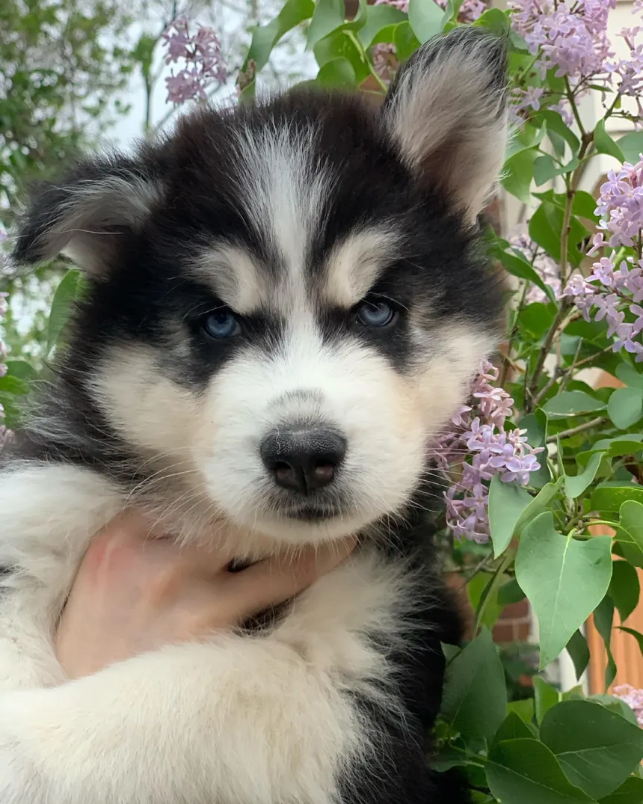
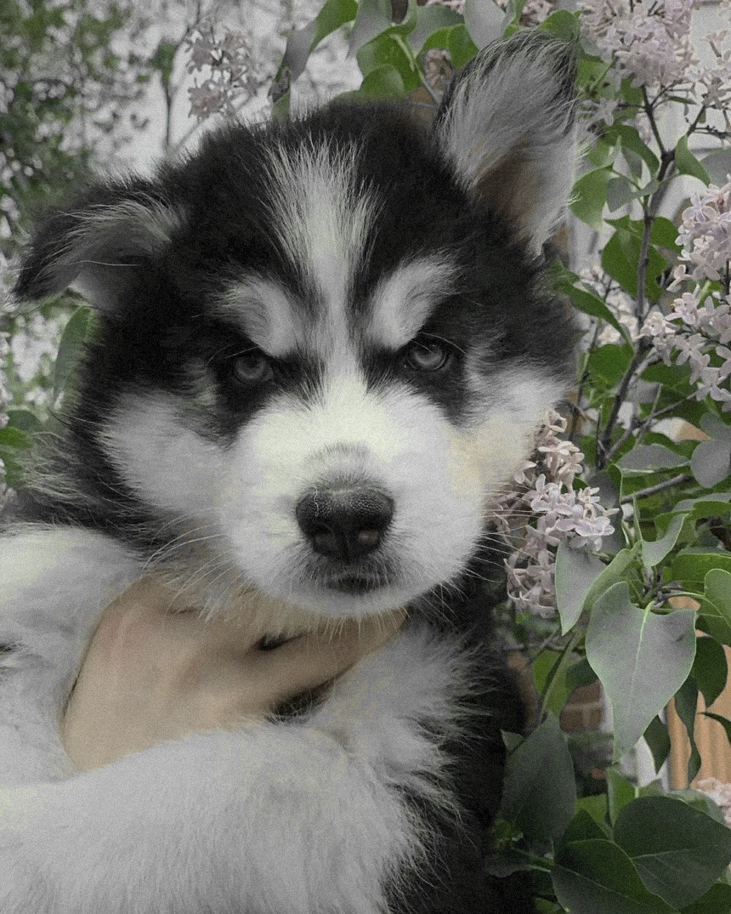
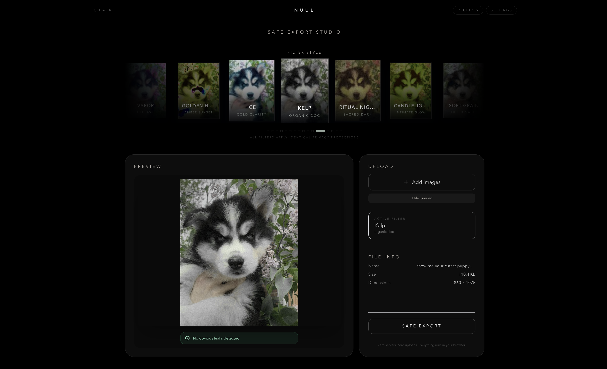
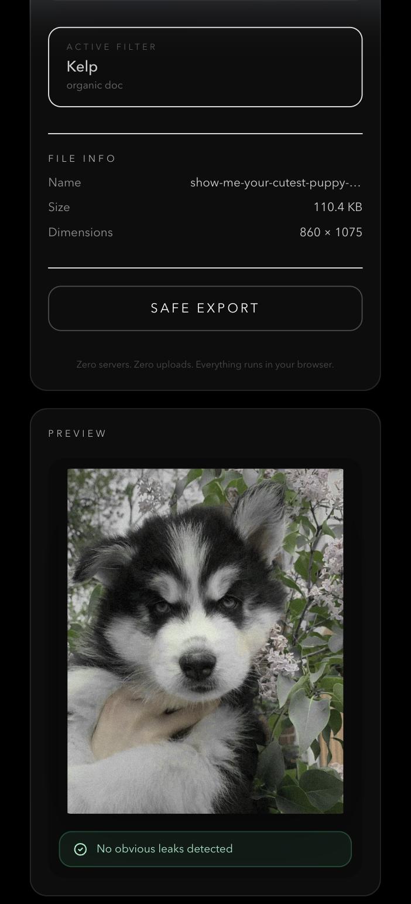
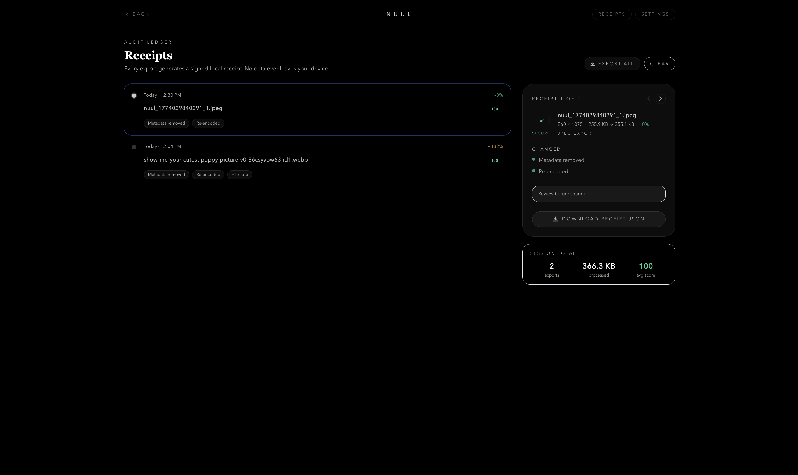
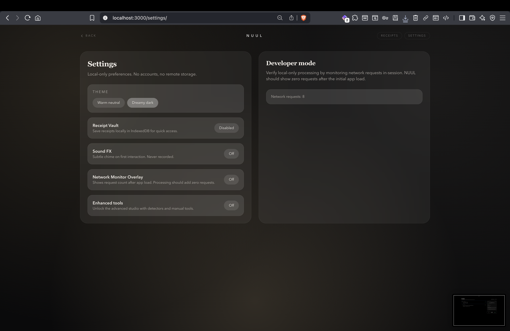
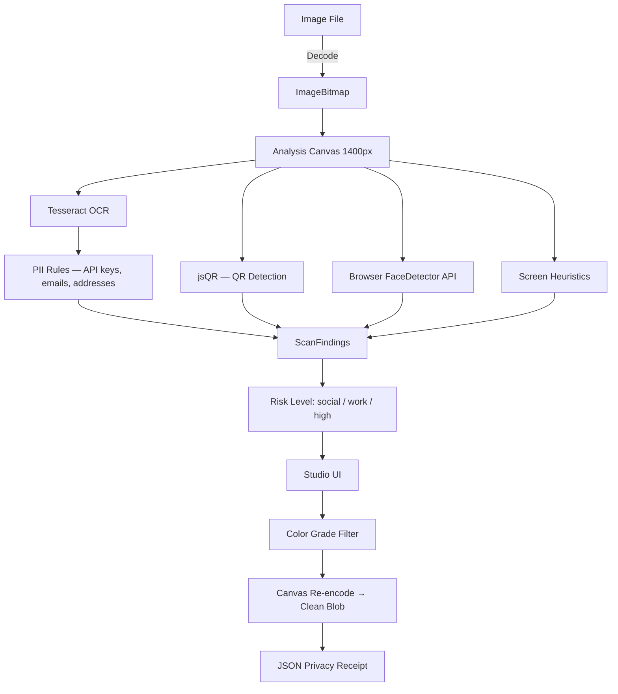

# 𝘕𝘶𝘶𝘭


[](https://www.typescriptlang.org)
[](https://nextjs.org)
[]()
[]()
[]()
[](LICENSE)
[](https://vanessamadison.com)

---

## 𝘖𝘷𝘦𝘳𝘷𝘪𝘦𝘸

**Nuul** is a browser-native privacy photo studio that strips EXIF, GPS, and device metadata from photos up to 50 MB — entirely in your browser, with zero server storage and zero network transmission.

It is also a full consumer-grade filter app. Choose from sixteen built-in color grades or import your own Lightroom `.xmp` presets. Every export is re-encoded pixel-by-pixel through a full Lightroom-compatible pipeline: the output file contains only image data. No metadata containers, no GPS coordinates, no device fingerprints survive.

Nuul is for people who care about both how their photos look and what their photos reveal.

---

## 𝘞𝘩𝘢𝘵 𝘪𝘵 𝘭𝘰𝘰𝘬𝘴 𝘭𝘪𝘬𝘦

<table>
<tr>
<td align="center" width="50%">

<br/>
<em>The original — metadata intact, device and location embedded in every pixel container</em>
</td>
<td align="center" width="50%">

<br/>
<em>Filtered with Kelp — deep organic tones applied, all metadata structurally removed at export</em>
</td>
</tr>
</table>

<br/>

<table>
<tr>
<td align="center" width="65%">

<br/>
<em>Studio desktop — filter carousel with live thumbnails, each card rendering the actual image in real time</em>
</td>
<td align="center" width="35%">

<br/>
<em>Mobile view — Cornerclub selected, the 35mm warm grade active on upload</em>
</td>
</tr>
</table>

<br/><br/>

<table>
<tr>
<td align="center" width="50%">

<br/>
<em>Privacy receipts — signed JSON logs of what was found and removed, stored in a private local vault</em>
</td>
<td align="center" width="50%">

<br/>
<em>Settings — local-only preferences, network monitor showing zero requests, developer mode for verification</em>
</td>
</tr>
</table>

---

## 𝘒𝘦𝘺 𝘊𝘢𝘱𝘢𝘣𝘪𝘭𝘪𝘵𝘪𝘦𝘴

- **Sixteen aesthetic filter presets**
  Silverline, Cornerclub, Midnightrun, Loftsunday, Basement, Bluehour, Faded, Mocha, Vapor, Golden Hour, Ice, Kelp, Ritual Night, Candlelight, Soft Grain, and Ritual. Every preset applies the full seven-stage pixel pipeline. Filter choice is aesthetic — privacy protection is identical across all.

- **Lightroom preset support**
  Import `.xmp` files directly from Lightroom Classic or Lightroom CC. Presets are parsed in the browser and applied via a pixel-level color grading engine with no server, no conversion tool, no upload.

- **Complete metadata removal**
  Canvas re-encoding strips EXIF, GPS coordinates, device make/model, embedded thumbnails, and all other metadata containers by construction — not by deletion. The output blob is structurally clean.

- **OSINT obfuscation scan**
  Before export, nuul scans for common leaks: API keys, emails, addresses, phone numbers via OCR; QR codes via pixel analysis; face regions via browser-native face detection; browser chrome and open tabs via heuristic screen analysis.

- **Privacy receipt**
  Every export generates a signed JSON receipt documenting what was found and removed. Receipts are stored in a local-only vault within your browser, ensuring no data ever touches a server or is saved to an external database.

- **Zero-network architecture**
  No analytics. No telemetry. No CDN requests during processing. Tesseract OCR assets are served locally. All computation runs in the browser tab.

---

## 𝘍𝘪𝘭𝘵𝘦𝘳 𝘌𝘯𝘨𝘪𝘯𝘦

The nuul filter engine applies Lightroom-compatible color grading through a multi-stage pixel pipeline:

1. **Tone curve LUT** — exposure (linear EV scale), contrast (S-curve around pivot 0.5), highlights/shadows (tone-range adjustments), whites/blacks (endpoint compression)
2. **Per-channel RGB curves** — independent tone curves for red, green, blue channels using Fritsch-Carlson monotone cubic spline interpolation
3. **Temperature / Tint** — per-pixel color shift derived from the raw Kelvin value and green/magenta tint offset stored in the XMP
4. **Saturation** — global HSL saturation multiplier
5. **Vibrance** — selective saturation that boosts desaturated colors more, leaving already-saturated tones stable
6. **HSL per-hue adjustments** — eight Lightroom color ranges (red, orange, yellow, green, aqua, blue, purple, magenta) with cosine bell falloff
7. **Vignette + Grain** — radial gradient overlay and per-pixel luminance noise

Preview rendering runs at 900px for sharp real-time feedback. Export rendering runs at full resolution. Carousel thumbnails are generated live from the imported image at 120px.

### Importing Lightroom Presets

Lightroom exports presets as `.xmp` files containing XML with `crs:` namespace attributes. Nuul parses these directly in the browser using the DOM parser and maps the following fields:

`Exposure2012`, `Contrast2012`, `Highlights2012`, `Shadows2012`, `Whites2012`, `Blacks2012`, `Temperature`, `Tint`, `Vibrance`, `Saturation`, `Clarity2012`, `Dehaze`, `VignetteAmount`, `GrainAmount`, `SharpenAmount`, `PresetName`

Multiple presets can be imported at once. Imported presets appear in the filter strip alongside built-ins with live thumbnails auto-generated from the current image.

---

## 𝘗𝘳𝘪𝘷𝘢𝘤𝘺 𝘔𝘦𝘤𝘩𝘢𝘯𝘪𝘴𝘮

The privacy guarantee is architectural, not procedural. Nuul does not delete metadata from the source file. Instead, it draws the image bitmap onto an HTML Canvas element — which captures only pixel data — and encodes a new blob from that canvas. The resulting file has no metadata containers because none were ever written.

This means:

- **EXIF data** (camera settings, timestamps, software) is gone because canvas has no mechanism to carry it
- **GPS coordinates** are gone for the same reason
- **Device identifiers** (Make, Model, Serial) are gone
- **Embedded thumbnail** variants stored in JPEG headers are gone
- **ICC color profiles** are stripped (canvas uses sRGB)

The approach is verified post-export using `exifr.parse()` on the output blob. A result of `null` or an empty object confirms clean output.

---

## 𝘖𝘚𝘐𝘕𝘛 𝘚𝘤𝘢𝘯 𝘗𝘪𝘱𝘦𝘭𝘪𝘯𝘦



---

## 𝘛𝘦𝘤𝘩 𝘚𝘵𝘢𝘤𝘬

**Core**
* Next.js 14, React 18, TypeScript 5
* Tailwind CSS

**Privacy Pipeline**
* `exifr` — EXIF parsing for scan and post-export verification
* `jsQR` — pure-JS QR code detection from ImageData
* `Tesseract.js` — local OCR (assets served from `/public/tesseract/`, no network)
* Browser `FaceDetector` API — face region detection where available
* Canvas 2D API — pixel-level filter engine and metadata-stripping re-encode

**Distribution**
* Static export via `next export` — deployable to Vercel, Netlify, Cloudflare Pages, or any CDN
* No backend required. No server. No database.

---

## 𝘘𝘶𝘪𝘤𝘬 𝘚𝘵𝘢𝘳𝘵

### Requirements

* Node.js 20 or newer
* npm or pnpm

### Local setup

```bash
# Install dependencies
npm install

# Start dev server
npm run dev
# → http://localhost:3000
```

### Deploy to Vercel (recommended)

```bash
# One-time setup — connect your GitHub repo at vercel.com
# or push and deploy from CLI:
npx vercel --prod
```

### Deploy to Cloudflare Pages

Set build command `npm run build`, output directory `out`. Connect the GitHub repo. Free tier, global CDN, no traffic limits.

### Static export

```bash
npm run build
# Output in /out — drop onto any static host
```

---

## 𝘜𝘴𝘪𝘯𝘨 𝘠𝘰𝘶𝘳 𝘓𝘪𝘨𝘩𝘵𝘳𝘰𝘰𝘮 𝘗𝘳𝘦𝘴𝘦𝘵𝘴

1. In Lightroom, right-click a preset → **Export** → save as `.xmp`
2. In Nuul Studio, click **Import Lightroom preset (.xmp)** in the filter strip
3. Select one or multiple `.xmp` files
4. The preset appears in the strip with a live thumbnail generated from your current image
5. Click to apply — the preview updates in real time at 900px
6. Export — the filter is baked into the output at full resolution before metadata stripping

---

## 𝘒𝘯𝘰𝘸𝘯 𝘓𝘪𝘮𝘪𝘵𝘢𝘵𝘪𝘰𝘯𝘴

* Canvas re-encoding converts to sRGB — wide-gamut (P3, ProPhoto) color profiles are not preserved
* Face detection uses the browser `FaceDetector` API — not available in Firefox or older Safari; falls back silently
* OCR accuracy depends on image resolution and font clarity; capped at a 3 s timeout to prevent UI blocking
* Receipt Vault uses localStorage — IndexedDB migration is planned
* Nuul does not protect against reverse image search or determined OSINT adversaries with access to the visual content

---

## 𝘙𝘰𝘢𝘥𝘮𝘢𝘱

* Tone curve editor with draggable control points
* HSL per-channel color adjustments
* `.cube` LUT support for cinematic color grades
* AI-assisted face and object blur
* Full IndexedDB receipt vault with export and search
* Plugin API for custom filter presets

---

## 𝘓𝘪𝘤𝘦𝘯𝘴𝘦 𝘢𝘯𝘥 𝘊𝘰𝘯𝘵𝘢𝘤𝘵

Nuul is released under the MIT License. See the [LICENSE](LICENSE) file for details.

**Author**: Vanessa Madison
**Site**: [vanessamadison.com](https://vanessamadison.com)

For collaboration, preset sharing, or security review discussions, open an issue or reach out through the site.
