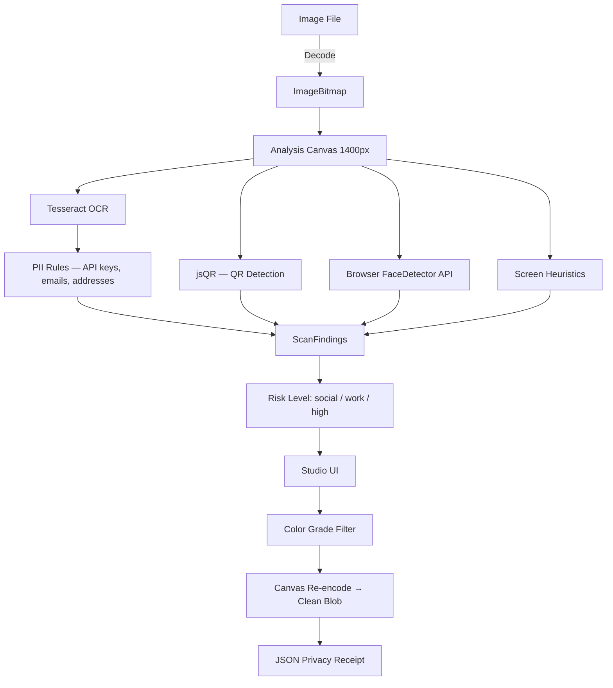

# 𝘕𝘶𝘶𝘭


[](https://www.typescriptlang.org)
[](https://nextjs.org)
[]()
[]()
[]()
[](LICENSE)
[](https://vanessamadison.com)

---

## 𝘖𝘷𝘦𝘳𝘷𝘪𝘦𝘸

**Nuul** is a browser-native privacy photo studio that strips EXIF, GPS, and device metadata from photos up to 50 MB — entirely in your browser, with zero server storage and zero network transmission.

It is also a full consumer-grade filter app. Import your own Lightroom `.xmp` presets or choose from built-in color grades. Every export is re-encoded pixel-by-pixel: the output file contains only image data. No metadata containers, no GPS coordinates, no device fingerprints survive the pipeline.

Nuul is designed for people who care about both how their photos look and what their photos reveal.

---

## 𝘒𝘦𝘺 𝘊𝘢𝘱𝘢𝘣𝘪𝘭𝘪𝘵𝘪𝘦𝘴

- **Lightroom preset support**
  Import `.xmp` files directly from Lightroom Classic or Lightroom CC. Presets are parsed in the browser and applied via a pixel-level color grading engine — no server, no conversion tool required.

- **Built-in filter library**
  Nine curated looks including Graphite, Warm Film, Soft Grain, Noir, Chrome, Ritual, Dusk, and Studio. Each is a full parameter set covering exposure, contrast, highlights, shadows, temperature, vibrance, saturation, vignette, and grain.

- **Complete metadata removal**
  Canvas re-encoding strips EXIF, GPS coordinates, device make and model, embedded thumbnails, and all other metadata containers by construction — not by deletion. The output blob is structurally clean.

- **OSINT obfuscation scan**
  Before export, nuul scans for common leaks: API keys, emails, addresses, phone numbers via OCR; QR codes via pixel analysis; face regions via browser-native face detection; browser chrome and open tabs via heuristic screen analysis.

- **Privacy receipt**
  Every export generates a signed JSON receipt listing what was found, what was changed, and what may remain. Stored locally in localStorage only.

- **Zero-network architecture**
  No analytics. No telemetry. No CDN requests during processing. Tesseract OCR assets are served locally. All computation runs in the browser tab.

---

## 𝘍𝘪𝘭𝘵𝘦𝘳 𝘌𝘯𝘨𝘪𝘯𝘦

The nuul filter engine applies Lightroom-compatible color grading through a multi-stage pixel pipeline:

1. **Tone curve LUT** — exposure (linear EV scale), contrast (S-curve around pivot 0.5), highlights/shadows (tone-range adjustments), whites/blacks (endpoint compression)
2. **Temperature / Tint** — per-pixel color shift derived from the raw Kelvin value and green/magenta tint offset stored in the XMP
3. **Saturation** — global HSL saturation multiplier
4. **Vibrance** — selective saturation that boosts desaturated colors more, leaving already-saturated tones stable (matching Lightroom's behavior)
5. **Vignette** — radial gradient overlay supporting both darkening and brightening modes
6. **Grain** — per-pixel luminance noise at configurable intensity

Preview rendering runs at 600px for real-time feedback. Export rendering runs at full resolution. Thumbnails in the filter strip are generated live from the imported image.

### Importing Lightroom Presets

Lightroom exports presets as `.xmp` files containing XML with `crs:` namespace attributes. Nuul parses these directly in the browser using the DOM parser and maps the following fields:

`Exposure2012`, `Contrast2012`, `Highlights2012`, `Shadows2012`, `Whites2012`, `Blacks2012`, `Temperature`, `Tint`, `Vibrance`, `Saturation`, `Clarity2012`, `Dehaze`, `VignetteAmount`, `GrainAmount`, `SharpenAmount`, `PresetName`

Multiple presets can be imported at once. Imported presets appear in the filter strip alongside built-ins and are auto-applied to the current image.

---

## 𝘗𝘳𝘪𝘷𝘢𝘤𝘺 𝘔𝘦𝘤𝘩𝘢𝘯𝘪𝘴𝘮

The privacy guarantee is architectural, not procedural. Nuul does not delete metadata from the source file. Instead, it draws the image bitmap onto an HTML Canvas element — which captures only pixel data — and then encodes a new blob from that canvas. The resulting file has no metadata containers because none were ever written.

This means:

- **EXIF data** (camera settings, timestamps, software) is gone because canvas has no mechanism to carry it
- **GPS coordinates** are gone for the same reason
- **Device identifiers** (Make, Model, Serial) are gone
- **Embedded thumbnail** variants stored in JPEG headers are gone
- **ICC color profiles** are stripped (the canvas uses sRGB)

The approach is verified post-export using `exifr.parse()` on the output blob. A result of `null` or an empty object confirms clean output.

---

## 𝘖𝘚𝘐𝘕𝘛 𝘚𝘤𝘢𝘯 𝘗𝘪𝘱𝘦𝘭𝘪𝘯𝘦



---

## 𝘛𝘦𝘤𝘩 𝘚𝘵𝘢𝘤𝘬

**Core**
* Next.js 14, React 18, TypeScript 5
* Tailwind CSS
* anime.js for motion

**Privacy Pipeline**
* `exifr` — EXIF parsing for scan and post-export verification
* `jsQR` — pure-JS QR code detection from ImageData
* `Tesseract.js` — local OCR (assets served from `/public/tesseract/`, no network)
* Browser `FaceDetector` API — face region detection where available
* Canvas 2D API — pixel-level filter engine and metadata-stripping re-encode

**Distribution**
* Static export via `next export` for zero-server deployment
* Capacitor for iOS wrapping
* Electron for desktop

---

## 𝘘𝘶𝘪𝘤𝘬 𝘚𝘵𝘢𝘳𝘵

### Requirements

* Node.js 20 or newer
* npm or pnpm

### Local setup

```bash
# Install dependencies
npm install

# Start dev server
npm run dev
# → http://localhost:3000
```

### Static export

```bash
npm run build:export
# Output in /out — deployable to any static host (Vercel, Netlify, Cloudflare Pages)
```

### Desktop (Electron)

```bash
npm run build:export
npm run desktop:dev
# Build distributable:
npm run desktop:build
```

### Mobile (iOS via Capacitor)

```bash
npx cap add ios
npm run build:export
npm run mobile:sync
npm run mobile:ios
```

---

## 𝘜𝘴𝘪𝘯𝘨 𝘠𝘰𝘶𝘳 𝘓𝘪𝘨𝘩𝘵𝘳𝘰𝘰𝘮 𝘗𝘳𝘦𝘴𝘦𝘵𝘴

1. In Lightroom, right-click a preset → **Export** → save as `.xmp`
2. In Nuul Studio, click **Import Lightroom preset (.xmp)** in the filter strip
3. Select one or multiple `.xmp` files
4. The preset appears in the strip with a live thumbnail generated from your current image
5. Click to apply — the preview updates in real time
6. Export — the filter is baked into the output at full resolution before metadata stripping

---

## 𝘒𝘯𝘰𝘸𝘯 𝘓𝘪𝘮𝘪𝘵𝘢𝘵𝘪𝘰𝘯𝘴

* Canvas re-encoding converts to sRGB — wide-gamut (P3, ProPhoto) color profiles are not preserved
* Face detection uses the browser `FaceDetector` API — not available in Firefox or older Safari; falls back silently
* OCR accuracy depends on image resolution and font clarity
* Manual redaction tools are UI-only in the current release
* Receipt Vault uses localStorage — IndexedDB migration is planned
* Nuul does not protect against reverse image search or determined OSINT adversaries with access to the visual content

---

## 𝘙𝘰𝘢𝘥𝘮𝘢𝘱

Planned directions for future versions include:

* Tone curve editor with draggable points
* HSL per-channel color adjustments
* `.cube` LUT support for cinematic color grades
* AI-assisted face and object blur
* Batch processing for multiple files
* Full IndexedDB receipt vault with export and search
* Plugin API for custom filter presets

---

## 𝘓𝘪𝘤𝘦𝘯𝘴𝘦 𝘢𝘯𝘥 𝘊𝘰𝘯𝘵𝘢𝘤𝘵

Nuul is released under the MIT License. See the [LICENSE](LICENSE) file for details.

**Author**: Vanessa Madison
**Site**: [vanessamadison.com](https://vanessamadison.com)

For collaboration, preset sharing, or security review discussions, open an issue or reach out through the site.
